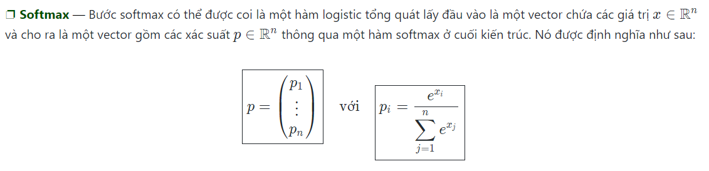

# Tổng quan
Kiến trúc truyền thống của một mạng CNN - Mạng neural tích chập (Convolutional neural networks), còn được biết đến với tên CNNs, là một dạng mạng neural được cấu thành bởi các tầng sau:

Tầng tích chập và tầng pooling có thể được hiệu chỉnh theo các siêu tham số (hyperparameters) được mô tả ở những phần tiếp theo.
# Các kiểu tầng
## Tầng tích chập (CONV)
Tầng tích chập (CONV) sử dụng các bộ lọc để thực hiện phép tích chập khi đưa chúng đi qua đầu vào II theo các chiều của nó. Các siêu tham số của các bộ lọc này bao gồm kích thước bộ lọc FF và độ trượt (stride) SS. Kết quả đầu ra OO được gọi là feature map hay activation map.

## Tầng Pooling (POOL)
Tầng pooling (POOL) là một phép downsampling, thường được sử dụng sau tầng tích chập, giúp tăng tính bất biến không gian. Cụ thể, max pooling và average pooling là những dạng pooling đặc biệt, mà tương ứng là trong đó giá trị lớn nhất và giá trị trung bình được lấy ra.
| Kiểu      | Max pooling          | Average pooling  |
| ----------|--------------------| ----------------|
| Chức năng | Từng phép pooling chọn giá trị lớn nhất trong khu vực mà nó đang được áp dụng | Từng phép pooling tính trung bình các giá trị trong khu vực mà nó đang được áp dụng |
| Minh họa  |  |  |
| Nhận xét  | Bảo toàn các đặc trưng đã phát hiện; Được sử dụng thường xuyên | Giảm kích thước feature map; Được sử dụng trong mạng LeNet |
## Tầng Fully Connected (FC)
Tầng kết nối đầy đủ (FC) nhận đầu vào là các dữ liệu đã được làm phẳng, mà mỗi đầu vào đó được kết nối đến tất cả neuron. Trong mô hình mạng CNNs, các tầng kết nối đầy đủ thường được tìm thấy ở cuối mạng và được dùng để tối ưu hóa mục tiêu của mạng ví dụ như độ chính xác của lớp.

## Một số hàm thường gặp
### Rectified Linear Unit: 
##### Tầng rectified linear unit (ReLU) là một hàm kích hoạt g được sử dụng trên tất cả các thành phần. Mục đích của nó là tăng tính phi tuyến tính cho mạng. Những biến thể khác của ReLU được tổng hợp ở bảng dưới:
|ReLU           |Leaky ReLU                |ELU                         |
| --------------|------------------------|---------------------------|
|g(z)=max(0,z)  |g(z)=max(ϵz,z)  với ϵ≪1  |g(z)=max(α(e^z−1),z) với α≪1 |
|[image](https://user-images.githubusercontent.com/79900186/115330150-b6a3a180-a1bd-11eb-9439-d348e3ad1e37.png)||| 
|               | Khắc phục vấn đề ReLU chết cho những giá trị âm | Khả vi tại mọi nơi |
### Softmax: 
##### Áp dụng một hàm mũ tiêu chuẩn cho mỗi phần tử của lớp đầu ra, và sau đó chuẩn hóa các giá trị này bằng cách chia cho tổng của tất cả các cấp số nhân. Làm như vậy đảm bảo tổng của tất cả các giá trị lũy thừa cộng lại bằng 1.

# Nguồn Tham khảo
https://stanford.edu/~shervine/l/vi/teaching/cs-230/cheatsheet-convolutional-neural-networks

