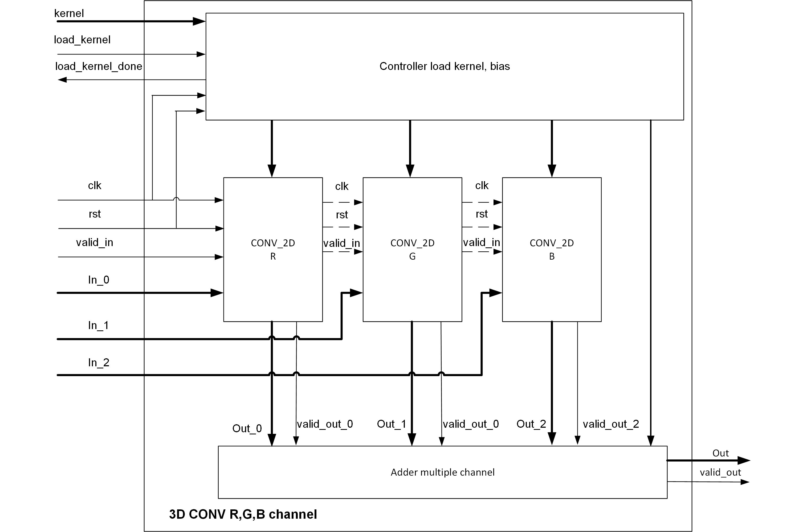

## Line buffer base

## Convolution - MAXPOOL - AVGPOOL kernel 3x3, 5x5, 7x7, padding and can config stride.

## 3D Convolution with R,G,B channel - 3x3x3 kernel

## 64 layers 3D convolution with R,G,B channel - 3x3x3x64 kernel
## Top module, for testing Convolution - MAXPOOL - AVGPOOL kernel 3x3, 5x5, 7x7, padding and can config stride.

